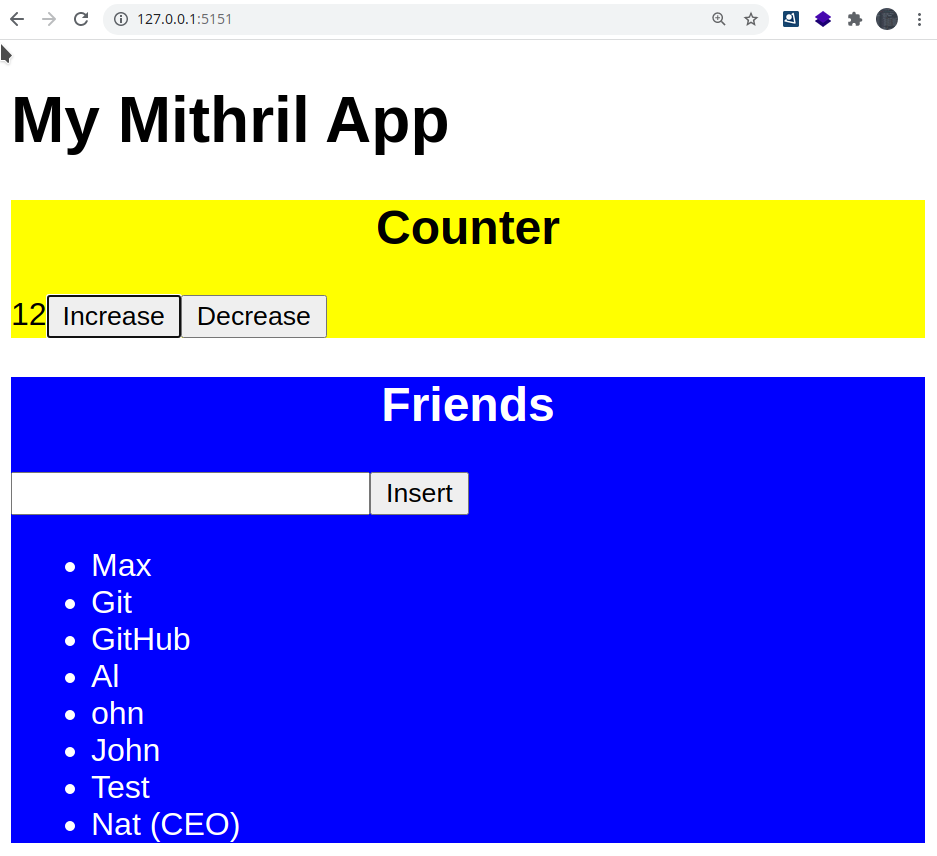

# Mithril TS(Type script) JSX

If you already know MithrilJS, you have to write the tempalte and layout in HybridScript way and you cannot do that in such a way like ReactJS.
So in this example we are going to create a simple project with **Mithril** framework but with a JSX way.

**First component:** a counter which you can increase a number between 0 and infinity :)

**Second component:** you can add name of your friends and its work dynamically.

### Using

- `$ npm install`
- `$ npm run dev`
- `$ npm run build`
- `$ npm run preview`

### Credit

Thank you from **Arthur Clemens**, and **Kevin Fiol** for helping me to config a Build system correctly. Now I have really a good feel while it's possible to config JSX syntax inside MithrilJS library on front of TypeScript which is a good tool for big project.

© Copyright 2021, Max Base
